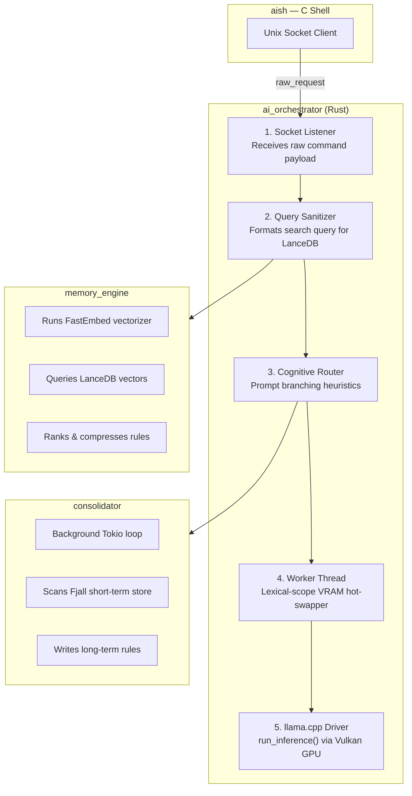
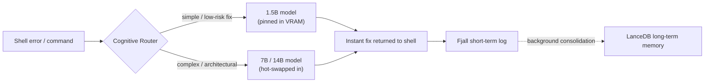

# aish 🐚
### Aswin's Intelligent Shell

A Unix shell built from scratch in C, supercharged by a highly optimized, local AI orchestrator written in Rust.

> Built by [Aswin K](https://github.com/Aswin-K-2005) — Legion 5i Pro + i9 + RTX 4070Ti doing the heavy lifting.


---

## What is aish?

Most people use a shell without understanding what happens when they press Enter. **aish** started as a learning project built from zero using raw C and POSIX system calls — no shortcuts, no libraries.

It has since evolved into a **Cognitive AI Terminal**. Instead of relying on cloud APIs or slow Python wrappers, `aish` uses a native Rust orchestrator communicating via Unix sockets to run local LLMs (via `llama.cpp`) and a native RAG memory engine. It learns from your daily workflow, predicts fixes, and acts as a local agentic assistant — all running entirely offline.

---

## Current Features

### 💻 Core Shell (C & POSIX)
- [x] Command execution & standard builtins (`cd`, `help`, `history`, `exit`)
- [x] Output/input redirection (`>`, `>>`, `<`) and piping (`|`)
- [x] Background jobs (`&`) with job completion notifications
- [x] Raw mode + arrow key history
- [x] Ghost text & tab autocomplete (Trie structure)
- [x] Logical operators (`&&` and `||`)

### 🧠 AI & Memory Engine (Rust)
- [x] **Local AI inference** — bare-metal `llama.cpp` integration (Vulkan accelerated)
- [x] **Lexical VRAM hot-swapping** — keeps a fast 1.5B model pinned for instant auto-fixes, dynamically loads 7B/14B models for deep architectural reasoning
- [x] **Semantic RAG memory** — uses `FastEmbed` and `LanceDB` to vector-search past shell errors and learn custom fixes over time
- [x] **Short-term context** — uses `Fjall` for ultra-fast IPC state tracking
- [x] **Cognitive routing** — Rust natively calculates heuristics to determine whether to provide an instant fix or trigger deep reasoning
- [ ] **Agentic tool use** *(WIP)* — ReAct loop allowing the LLM to execute `grep`, `cat`, and file searches directly in the shell

---

## Architecture

`aish` uses a decoupled architecture. The C shell handles raw POSIX operations and UI, while the heavy AI lifting is pushed to an asynchronous Rust backend over IPC.



### Cognitive routing at a glance



---

## Build and Run

### Prerequisites
- GCC / Clang
- Rust & Cargo (`rustc 1.75+`)
- Local GGUF models (placed in `models/` directory)

### 1. Build the Rust AI orchestrator

```bash
# Compile the memory engine and inference backend
cargo build --release
```

### 2. Compile the C shell

```bash
# Compile the shell with AI socket extensions
make
```

### 3. Run

```bash
# Start the shell (the orchestrator daemon will handle AI requests)
./aish
```

---

## Project Structure

```
My_shell/
├── ai.c / ai.h           # C Shell: AI Unix socket communication
├── new.c                 # C Shell: POSIX process & input management
├── ai_orchestrator/      # Rust: Tokio async server & llama.cpp bindings
├── memory_engine/        # Rust: FastEmbed, LanceDB, and Fjall IPC
├── shared_types/         # Rust: Shared data structures across workspaces
├── models/               # Local GGUF weights (git-ignored)
└── Cargo.toml            # Rust workspace definition
```

---

## Roadmap 🚀

### Phase 1 & 2 — Shell Polish (Completed)
- [x] Raw mode, autocomplete, piping, redirection, background jobs

### Phase 3 — Systems-Level AI Integration (Current)
- [x] Replace Python/cloud APIs with native Rust/llama.cpp
- [x] Build semantic memory engine (LanceDB/FastEmbed)
- [x] Implement VRAM resource management for SLMs
- [ ] Implement C-side `popen()` for agentic tool execution (`<tool_call>`)

### Phase 4 — The Cognitive Loop
- [ ] Upgrade memory schema to track success/failure confidence rates
- [ ] Enable the orchestrator to dynamically manage context windows for codebase ingestion
- [ ] Daemonize the orchestrator as a background OS service

---

## Concepts & Where They're Used

| Concept | Where it's used |
|---|---|
| C / POSIX systems | `fork()`, `execvp()`, `dup2()`, `waitpid()`, `SIGCHLD`, `termios` |
| Inter-process comm. | Unix domain sockets connecting C to Rust |
| Concurrency (Rust) | Tokio async/await, `mpsc` channels, multi-threading |
| Memory bounds | Lexical scoping to force VRAM allocation/deallocation |
| Machine learning | Quantized GGUF inference, vector embeddings, RAG pipelines |
| Constrained decoding | Probability redistribution and LLM cognitive branching |

---

## References

- [Write a Shell in C — Stephen Brennan](https://brennan.io/2015/01/16/write-a-shell-in-c/)
- [Build Your Own Text Editor — kilo](https://viewsourcecode.org/snaptoken/kilo/)
- Linux man pages: `fork(2)`, `execvp(3)`, `waitpid(2)`, `dup2(2)`, `pipe(2)`, `termios(3)`
- `llama.cpp` and `tokio` documentation

---

`aish` is actively being developed as a daily-driver tool. Star it to follow the journey from a basic shell to an autonomous system.
